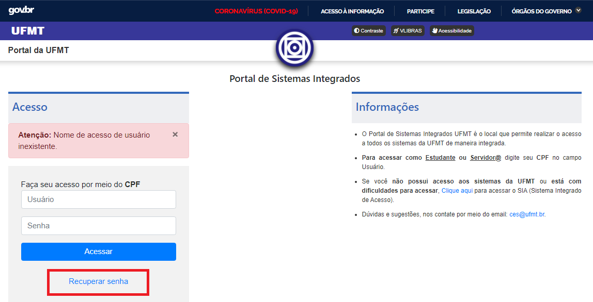
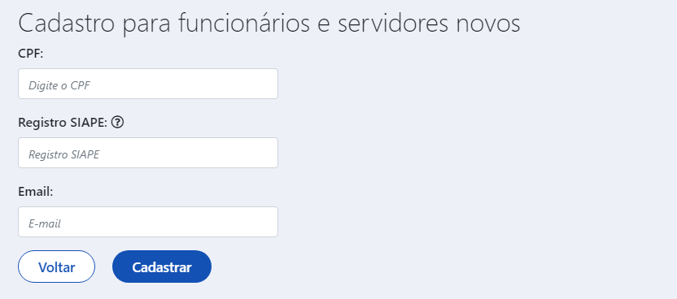
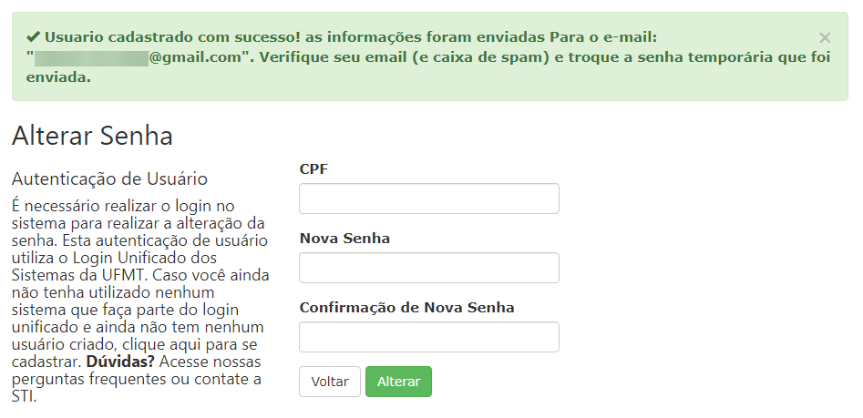

---

# Guia de Orientação para usuários(as) do Portal de Sistemas Integrados da UFMT

## 1 - Introdução

O acesso ao Portal de Sistemas da UFMT é feito acessando o Portal da UFMT <https://www.ufmt.br> > Serviços > Portal de Sistemas Integrados ou direto pelo endereço <https://sistemas.ufmt.br/ufmt.portalsistemas>.

No endereço basta informar seu CPF e sua senha.

Se for exibida a interface mostrada na Figura 1, isto mostra que você está autenticado(a) e apto(a) a acessar os sistemas da UFMT.

> 
> Figura 1 - Tela inicial do Portal de Sistemas Integrados

Caso seja mostrada a mensagem "Senha de acesso do usuário inválida", como mostra a Figura 2, siga os procedimentos para a recuperação de sua senha
na seção [2 - Recuperação de senha](#2-recuperacao-de-senha).

> 
> Figura 2 - Aviso de senha inválida

Caso seja mostrada a mensagem "Nome de acesso de usuário inexistente", como mostra a Figura 3, você precisa se cadastrar como um novo usuário.
Para isto, siga os procedimentos para o cadastro de um novo usuário na seção [3 - Cadastro de novo usuário](#3-cadastro-de-novo-usuario).

> 
> Figura 3 - Aviso de usuário inexistente

## 2 - Recuperação de senha

Se você esqueceu sua senha, basta clicar no link 'Recuperar Senha' como mostra a Figura 2 ou acesse diretamente o endereço <https://sistemas.ufmt.br/ufmt.sia/Usuario/ReiniciarSenha>.

Será apresentada uma tela conforme mostra a Figura 4. Informe seu CPF e clique no botão 'Reiniciar senha'. Atenção: clique apenas uma vez.

> 
> Figura 4 - Tela para solicitar o reinício da senha

Depois de informar o seu CPF e clicar no botão 'Reiniciar senha', você será informado sobre a confirmação de um e-mail enviado, semelhante a mensagem de confirmação que é mostrada na Figura 5.

> 
> Figura 5 - Tela senha reiniciada com sucesso

Agora verifique seu e-mail (e também a caixa de spam). A mensagem pode levar de 5 a 15min para chegar. Clique no endereço que consta no e-mail recebido, conforme destaca o exemplo na Figura 6.

**Atenção:** Se passaram mais de 15min, você já checou sua caixa de entrada e a caixa de spam e não recebeu a mensagem da UFMT, provavelmente seu e-mail está desatualizado no nosso cadastro.
Você pode solicitar a atualização do seu e-mail seguindo as instruções na seção [4 - Solicitar atualização do e-mail](#4-solicitar-atualizacao-do-e-mail).

> 
> Figura 6 - Email para recuperação de senha

Depois de clicar no link indicado na Figura 6, será exibida uma tela conforme mostra a Figura 7. Nesta tela digite seu CPF, sua nova senha e repita a sua senha no campo de confirmação.
Clique no botão Alterar.

**Atenção:** certifique-se de criar uma senha com ao menos uma letra maiúscula, um número e com no mínimo 8 caracteres.

> 
> Figura 7 - Tela para cadastro da nova senha

Tendo sucesso, uma tela de confirmação será exibida, conforme mostra a Figura 8.

> 
> Figura 8 - Tela de confirmação de senha alterada

Parabéns, agora você esta apto(a) a acessar o Portal de Sistemas Integrados, pelo site da UFMT ou acessando o endereço <https://sistemas.ufmt.br/ufmt.portalsistemas>.

## 3 - Cadastro de Novo Usuário

!!! warning "ATENÇÃO"
    O cadastro de novo usuário é apenas para servidores (docentes ou técnicos administrativos). Os discentes tem o usuário importado automaticamente quando são registrados na UFMT.

Para criar um usuário(a), basta acessar o endereço <https://sistemas.ufmt.br/ufmt.sia/Usuario/Cadastro>

Será apresentada uma tela conforme mostra a Figura 9. Digite seu CPF, seu SIAPE, seu e-mail pessoal e instransferível e clique no botão 'Cadastrar'.

> 
> Figura 9 - Tela para cadastro de novo usuário

Depois de informar seus dados corretamente, você será informado sobre a confirmação de um e-mail enviado, semelhante a mensagem de confirmação que é mostrada na Figura 10.

> 
> Figura 10 - Tela cadastro realizado com sucesso

Agora verifique seu e-mail (e também a caixa de spam). A mensagem pode levar de 5 a 15min para chegar. Clique no endereço que consta no e-mail recebido, conforme mostra a Figura 11.

> 
> Figura 11 - Email para recuperação de senha

Depois de clicar no link indicado na figura 11, será exibida uma imagem conforme mostra a Figura 12. Nesta tela informe seu CPF, sua nova senha e repita a sua senha no campo de confirmação.
Clique no botão Alterar.

**Atenção:** certifique-se de criar uma senha com ao menos uma letra maiúscula, um número e com no mínimo 8 caracteres.

> 
> Figura 12 - Tela para cadastro da nova senha

Tendo sucesso, uma tela de confirmação será exibida, conforme mostra a Figura 13.

> 
> Figura 13 - Tela de confirmação de senha alterada

Parabéns, agora você esta apto(a) a acessar o Portal de Sistemas Integrados, pelo site da UFMT ou acessando o endereço <https://sistemas.ufmt.br/ufmt.portalsistemas>.

## 4 - Solicitar atualização do e-mail

Para solicitar a atualização do seu e-mail no nosso cadastro, envie uma mensagem para o endereço <ces@ufmt.br> informando seu nome completo, CPF e o novo e-mail pessoal para cadastro.
Você também deve anexar na mensagem um documento válido com foto e um comprovante de endereço residencial.

## 5 - Contato

**E-mail**: ces@ufmt.br

**Call Center**: (65) 3615 - 8020

**Funcionamento**: 24/07/2020 *(horário de Cuiabá)*

* 7h30min as 11h30min
* 13h30min as 17h30min
* 18h30min as 22h30min