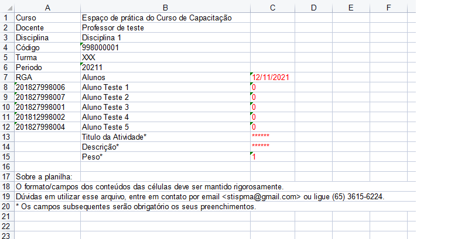
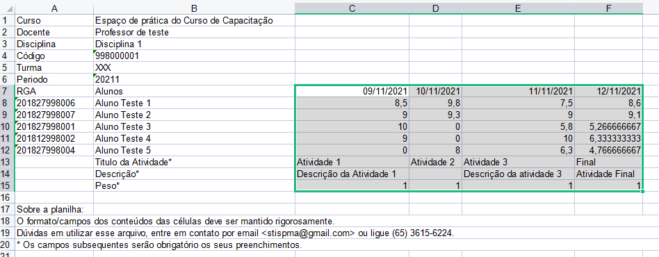
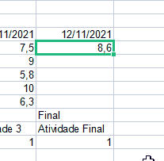
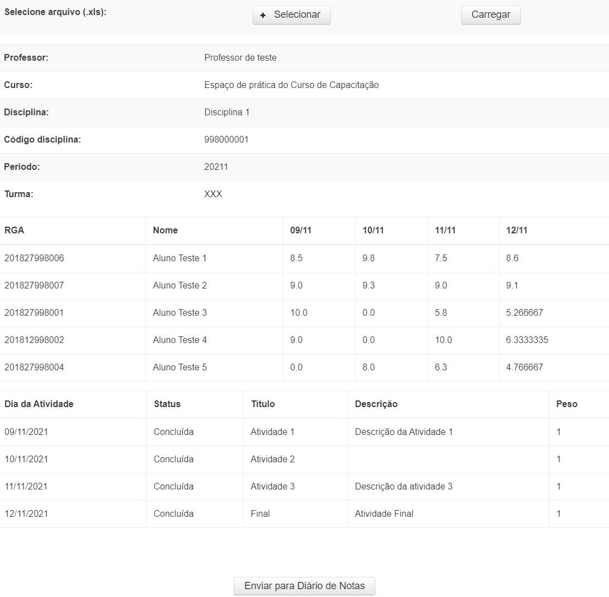
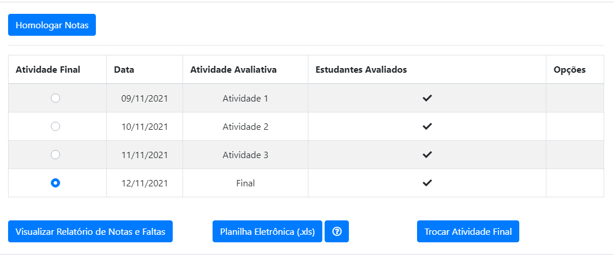
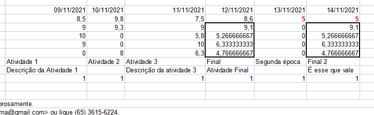

# Manual para lançamento de notas via Planilha Eletrônica

O Lançamento de Notas possui a opção de realizar o registro por **Planilha Eletrônica**, permitindo o registro de qualquer tipo de cálculo diretamente no arquivo Excel.

Quando o docente carregar o arquivo Excel, o sistema irá entender por padrão que a última atividade lançada no arquivo como sendo a **atividade final**.
É a nota dessa atividade que será registrada em histórico na eventual homologação do Lançamento de Notas.

Nessa planilha eletrônica o docente pode utilizar a forma que desejar para calcular as diversas atividades que ministrou.
No entanto, caso deseje adicionar ou remover atividades, deve realizar os procedimentos de importação e exportação novamente.

## Como utilizar

Para lançar as notas pelo arquivo Excel, primeiro o docente deve alterar o registro da disciplina.

Isso é feito no campo 'Tipo de média adotada para disciplina', conforme a Figura 1. O docente deve escolher a opção 'Planilha Eletrônica' e depois clicar no botão 'Alterar'. 

> 
> Figura 1 - Tipo de média adotada

Uma mensagem de sucesso deve ser informada pelo sistema.

Depois de alterada, no fim da página do Lançamento de Notas será exibido o botão 'Planilha Eletrônica', conforme a Figura 2.
Para prosseguir basta o docente clicar no botão.

> 
> Figura 2 - Botão Planilha Eletrônica

Depois de clicar no botão será exibida uma nova página, conforme a Figura 3.

Nessa página o docente tem os dados da disciplina e as opções 'Exportar Diário de Notas Online' e 'Importar Diário de Notas Online'.

> 
> Figura 3 - Exportar e importar diário

## Exportar diário de notas

Para baixar o arquivo Excel que será usado como modelo para o registro das notas, o docente deve clicar no botão 'Exportar Diário de Notas Online'.

Um arquivo será baixado, tendo o formato semelhante ao da Figura 4.

> 
> Figura 4 - Arquivo Excel em branco

Destacados em vermelho estão os dados que podem ser editados.

Para realizar o registro da atividade basta que o docente preencha os dados destacados.
Para lançar uma nova atividade basta repetir o lançamento na coluna D, E, F e assim por diante.

O primeiro campo que deve ser preenchido é a data da atividade. O formato é o DD/MM/AAAA, como na Figura 4. **As datas das atividades lançadas no arquivo Excel não podem ser repetidas**.

Abaixo da data e na linha que representa cada aluno, deve ser inserida a nota do aluno. **A nota do aluno não pode ficar vazia**.

Na sequência, depois do preenchimento da nota de todos os alunos, são apresentados os campos para informação do nome da atividade, da descrição e do peso.

O nome da atividade é obrigatório. É esse nome que será exibido no Portal Acadêmico. A descrição é um campo opcional.

O peso é um campo obrigatório e tem o valor padrão 1. Esse campo tem a função de auxiliar no preparo do cálculo mas deve ser aplicado no cálculo pelo docente.

!!! warning "ATENÇÃO"
    Qualquer preenchimento fora desse padrão descrito pode impedir a correta importação do arquivo pelo sistema.

Caso seja necessário manter observações ou outros registros no arquivo Excel, recomenda-se salvar uma cópia do arquivo com essas observações.

Na Figura 5 é apresentado um exemplo do arquivo Excel preenchido com as atividades e respectivas notas de cada discente

> 
> Figura 5 - Arquivo Excel preenchido

Por padrão, a última coluna de atividade preenchida no Excel será considerada como **atividade final**.

### Fórmulas do Excel

É possível aplicar fórmulas no Excel para auxiliar no cálculo das notas. Abaixo segue alguns exemplos:

* Para o cálculo de média simples, `=SOMA(C8:E8)/3`, onde:
    * `C8:E8` é o intervado de atividades lançadas no Excel e `3` é o número de ativdades lançadas
* Para o cálculo de média ponderada, `=((C8*C$15)+(D8*D$15)+(E8*E$15))/(C$15+D$15+E$15)`, onde:
    * `(C8*C$15)` é a nota da atividade multiplicada pelo seu respectivo peso. Note o sifrão na célula do peso. Essa anotação serve para dizer que esse valor é fixo

Depois que preenchida primeira célula com a fórmula, basta repetir nas demais linhas.
Para isso clique com o botao do mouse no canto inferior direito da célula e arraste até preencher todas as linhas que representam os alunos, conforme mostra a Figura 6.

>                                            
> Figura 6 - Replicando a fórmula no Excel

## Importar diário de notas

Para importar o arquivo Excel com as notas preenchidas, o docente deve clicar no botão 'Importar Diário de Notas Online'.

> 
> Figura 7 - Exportar e importar diário

Na tela seguinte o docente deve clicar no botão 'Selecionar' para escolher o arquivo e depois clicar no botão 'Carregar' para processar os lançamentos realizados.

> 
> Figura 8 - Importar diário preenchido no Excel

Se o arquivo Excel foi preenchido conforme as instruções dadas em [Exportar diário de notas](#exportar-diario-de-notas), a tela seguinte exibirá os dados preenchidos no arquivo para que o docente possa conferir antes de enviar.

> 
> Figura 9 - Conferência do arquivo importado

Finalizada as conferências, para enviar as notas clique em 'Enviar para Diário de Notas'.

> 
> Figura 10 - Atividades enviadas

## Outras situações

### Alunos novos

Caso exista um novo aluno na turma, basta baixar a planilha novamente.
O novo arquivo virá preenchido com os discentes que tiveram as notas preenchidas previamente e virá também com os novos discentes, estes sem ter a nota nas atividades.

Observe que a fórmula aplicada previamente não estará nesse novo arquivo baixado, por isso é importante manter uma cópia do arquivo enviado.

### Prova Final, Exame Final ou Exame de Segunda Época

Caso o curso tenha a previsão de realizar uma Prova Final, Exame Final ou Exame de Segunda Época, o docente usar o Excel para esse registro mas precisa ter cuidado no lançamento.

Como informado, a última coluna de atividade preenchida no Excel será considerada como atividade final. Assim, para que os discentes que não tiveram que fazer esse novo exame não sejam prejudicados com o lançamento vazio dessa nota, o docente deve, além de registrar a atividade relativa à nova nota, criar uma nova atividade.

Nessa nova atividade será registrada tanto a nota final do discente que teve prova final (ou qualquer outro tipo de nota) quanto a nota final já calculada dos demais discentes.

> 
> Figura 10 - Segunda época