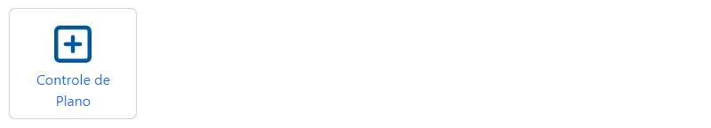
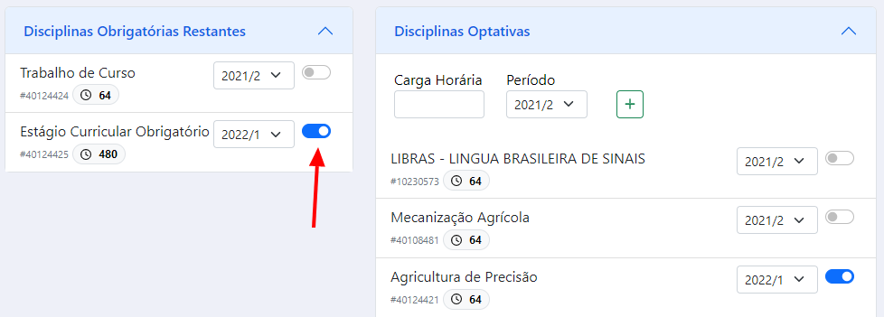
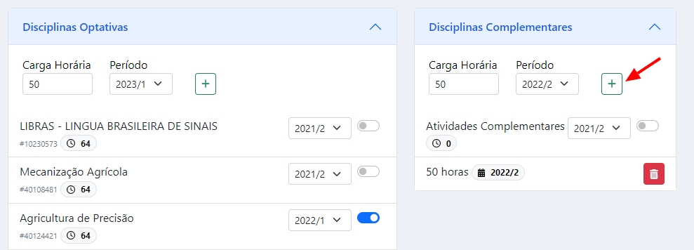
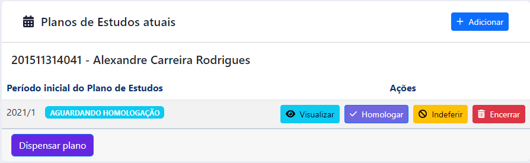
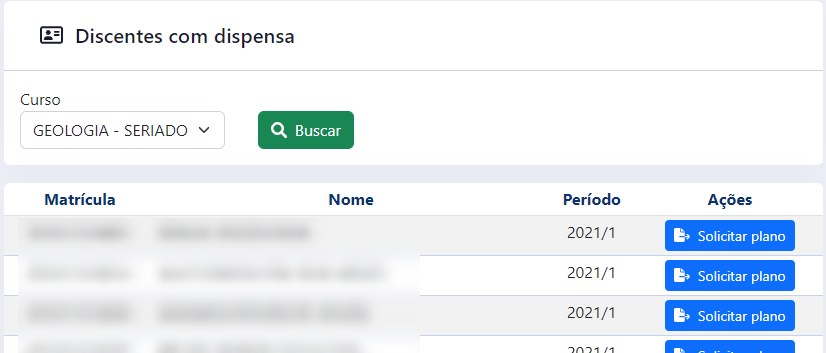

# Manual para registro de Plano de Estudos

!!! warning "ATENÇÃO"
    Consulte a Resolução Consepe n68, de 24/07/2014, na qual esse sistema se baseia, [clicando aqui](http://sistemas.ufmt.br/ufmt.resolucao/OpenResolucao.aspx?resolucaoUID=8626&ano=2014&tipoUID=2). 

Clique no botão 'Controle de Plano' para iniciar.

> 
> Figura 1 - Botão Controle de Plano

Na próxima tela você tem acesso à lista de cursos que coordena.
Escolha um curso e clique em 'Buscar'.
A lista que será apresentada é composta tanto pelos discentes que tem um plano de estudos em curso quanto pelos discentes que solicitaram um Plano de Estudos na última matrícula.

Note que o Plano de Estudos sempre visa o planejamento para o semestre posterior.
Portanto, para o devido registro de Plano de estudos, o discente deve estar regularmente matriculado no semestre atual.

Clique no botão azul na coluna 'Ações' () para ter acesso às respectivas ações disponíveis para o discente escolhido. 

## Discente com Solicitação de Plano de Estudos

Caso o discente esteja com a situação 'Solicitação de Plano de Estudo', a coordenação tem duas opções:

1. registrar uma dispensa de plano, informando o número do processo e uma observação
2. cadastrar um plano de estudos para o discente

### Registrar uma dispensa de plano

Caso a coordenação entenda necessário ou caso o discente venha a entrar em contato, a coordenação pode cancelar a solicitação de plano de estudos do discente, clicando no botão 'Dispensar plano'.

### Cadastro de Plano de Estudos

Para o cadastro do plano de estudos, basta clicar no botão 'Adicionar' depois de ter selecionado um discente que fez a solicitação de plano de estudos.

Na próxima tela serão exibidas todas as disciplinas pendentes da estrutura atual do discente.
Para informar quais disciplinas devem ser incluidas no plano, basta marcar a mesma clicando no botão em destaque, escolhendo também o período de execução da disciplina.  

> 
> Figura 2 - Tela Cadastro de Plano

Para disciplinas optativas, complementares, optativas livres e eletivas a coordenação também pode fazer um planejamento do quantitativo de carga horária que o discente deve executar.
Para isso basta informar o quantitativo, o período de execução e clicar no botão em destaque para adicionar.

> 
> Figura 3 - Tela Cadastro de Carga Horária adicional

Enquanto o plano de estudos não for homologado, a coordenação poderá criar novas versões do plano (que sobrescrevem a anterior) quantas vezes achar necessário. 

## Edição de Plano de Estudos

Apos salvar o plano de estudos este ficará com na situação 'Aguardando homologação' e a coordenação terá novas opções:

> 
> Figura 4 - Tela Edição de Plano

### Visualizar plano

Clique no botão 'Visualizar' para visualizar o plano de estudos programado

### Homologar plano

Clique no botão 'Homologar' para homologar o plano e encerrar a edição.

### Indeferir plano

Caso o plano ainda não tenha sido homologado, é possível indeferir o mesmo clicando no botão 'Indeferir'.

### Encerrar

Caso o plano esteja homologado, é possível encerrar o mesmo clicando no botão 'Encerrar'.

## Discente sem Solicitação de Plano de Estudos

> 
> Figura 5 - Tela Discentes com dispensa

Clique no botão 'Discentes com dispensa' para obter a lista de discentes que solicitaram a dispensa de plano de estudos na última matrícula.

A coordenação pode alterar a situação do discente para solicitante de plano de estudos. Para isso basta clicar no botão 'Solicitar plano' e informar o número do processo relacionado e uma observação.

Depois disso o nome do discente constará na lista para [Cadastro do plano de estudos](#cadastro-de-plano-de-estudos).

## Considerações finais

No fim de cada semestre são avaliados os planos de estudos criados. As seguintes situações são analisadas:

- o discente que encerra seu vinculo no curso ou por conclusão ou por alguma forma de desligamento definitivo e que possui um plano de estudos em execução tem esse plano alterado para ENCERRADO;
- o discente que reprova em disciplinas no período letivo tem o plano de estudos alterado para ENCERRADO POR DESCUMPRIMENTO DO PLANO;
- um plano de estudos que está aguardando homologação mas não é homologado ao fim do período letivo é alterado para ENCERRADO POR FALTA DE HOMOLOGAÇÃO;
