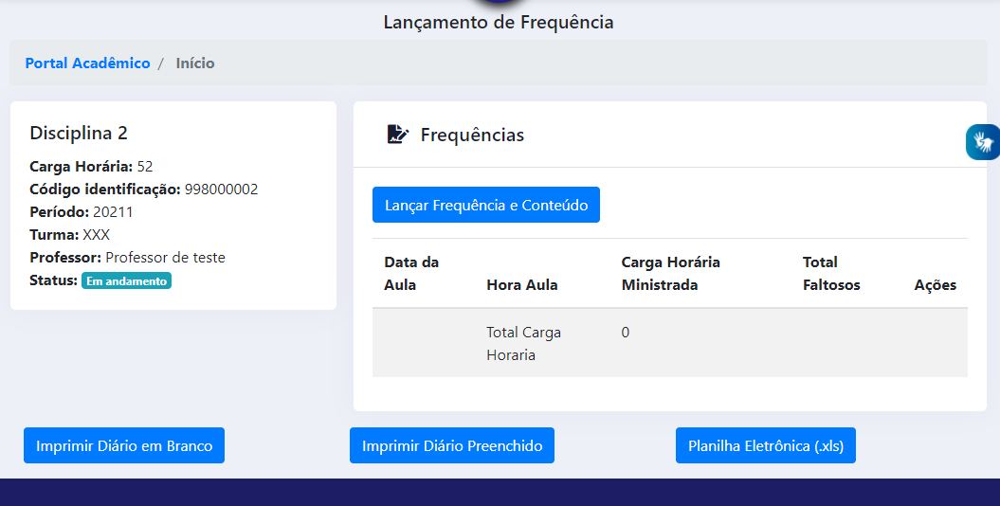
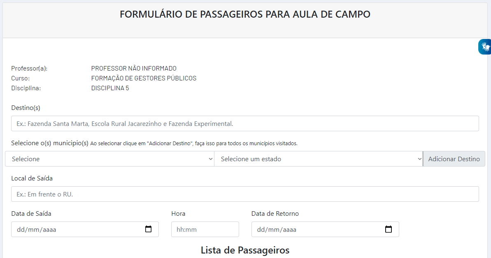

# Portal Acadêmico - Docente

O Portal Acadêmico da UFMT é o resumo dos esforços da STI em melhorar os serviços disponibilizados à comunidade acadêmica. Essa ferramenta tem por objetivo substituir gradualmente o atual Sistema de Informações de Gestão Acadêmica (SIGA) e foi desenvolvida observando diversas criticas e opiniões. Visa também a garantir uma maior acessibilidade às ferramentas dessa instituição e compatibilidade com os navegadores de internet e aparelhos móveis.

Atualmente o Portal Acadêmico do Docente conta com as seguintes Ferramentas do Professor:

* Salas virtuais
* Diários de Frequência
* Lançamento de Notas
* Planos de Ensino
* Aulas de Campo

E com as seguintes consultas:

* Estudantes

## Acesso

Para acessar o Portal Acadêmico basta que o docente acesse o Portal de Sistemas Integrados e busque por 'portal' ou 'pa' e clique no resultado, 'PA - Portal Acadêmico'.

## Salas Virtuals

Nesse local o docente tem acesso às disciplinas vinculadas à ele no Ambiente Virtual de Aprendizagem.

!!! warning "Atenção"
    A partir do semestre 2021/2 a UFMT passará a utilizar uma nova versão do ambiente de salas de aulas virtuais. Infelizmente a nova versão não é nativamente compatível com a atualmente utilizada, mas a versão atual ficará disponível para consultas e recuperação de backups, podendo estes backups serem restaurados pelos docentes para sua nova versão.

## Diários de Frequência

> 
> Figura 1 - Tela completa do Diário de Frequência

Semelhante a funcionalidade que existia anteriormente, nessa tela o docente consegue lançar as frequências da turma, imprimir o diário de frequência em branco ou preenchido e importar a frequência via planilha eletrônica (Excel). Para ter mais detalhes de como realizar a importação via planilha eletrônica, basta clicar [aqui](notasexcel.md).

## Lançamento de Notas

> 
> Figura 1 - Tela completa do Lançamento de Notas

Semelhante a funcionalidade que existia anteriormente, nessa tela o docente consegue lançar as atividades com nota da turma, cadastrando uma nova avaliação, bem ocmo visualizar o relatório de notas e faltas e importar as notas via planilha eletrônica (Excel).

## Planos de Ensino

Semelhante a funcionalidade que existia anteriormente, nessa tela o docente consegue lançar o Plano de Ensino de cada disciplina, para posterior aprovação pelo colegiado do curso. Também consegue importar o Plano de Ensino de períodos anteriores.

## Aulas de Campo

> 
> Figura 1 - Tela completa do Lançamento de Notas

Nessa tela o docente tem acesso ao formulário de passageiros para aula de campo.

## Críticas e Sugestões?

Encaminhe uma mensagem para ces.sti@ufmt.br

## Outros endereços úteis:

* [Manual para lançamento de notas via planilha eletrônica (Excel)](notasexcel.md)
* Manual do Novo AVA