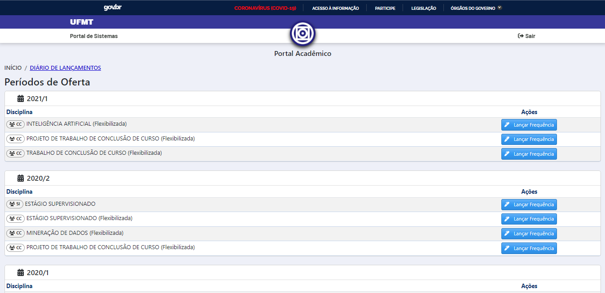
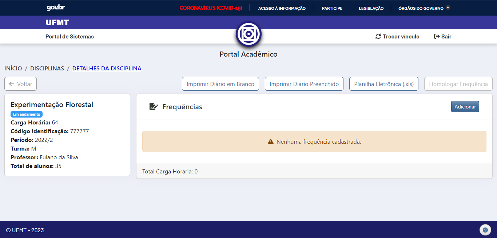
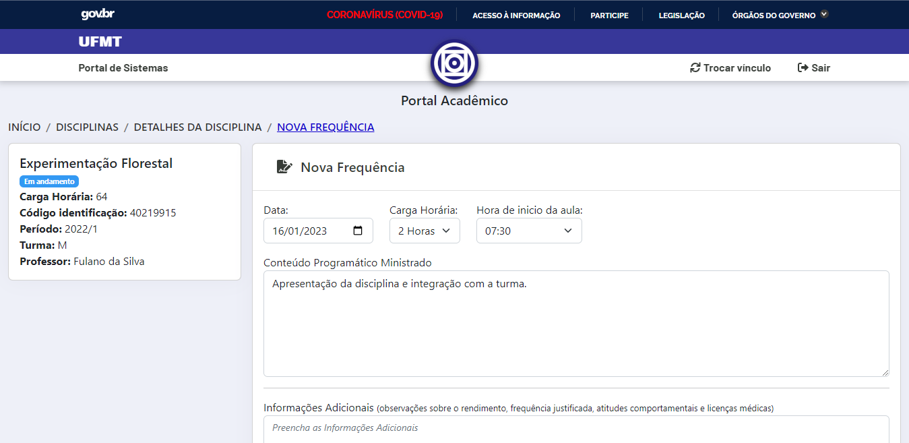
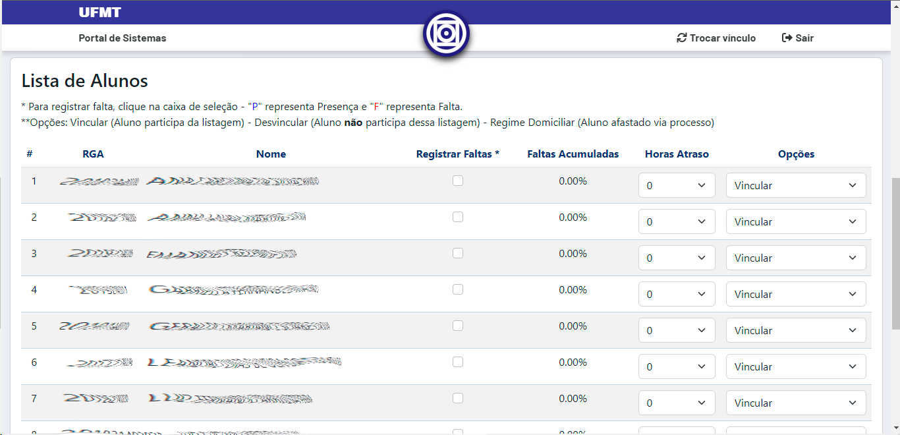
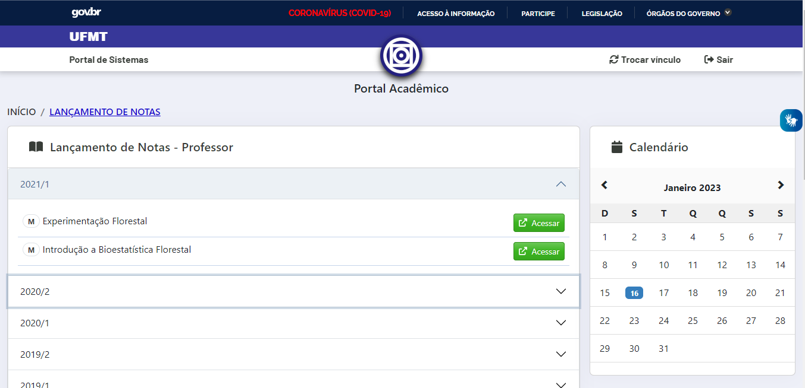
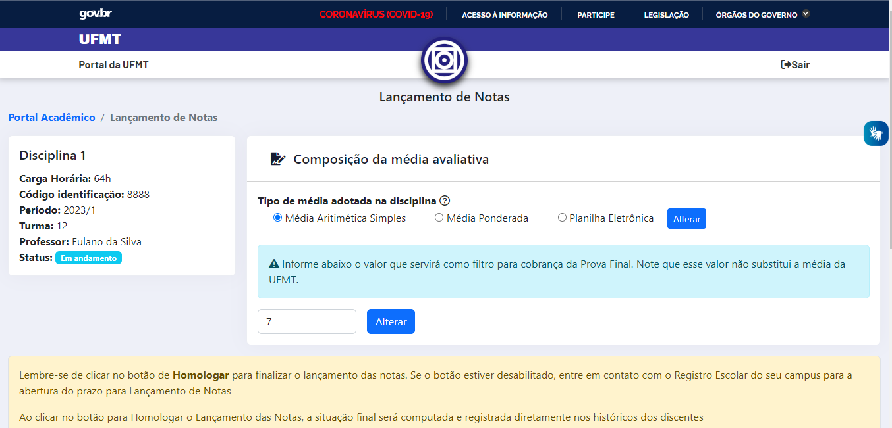
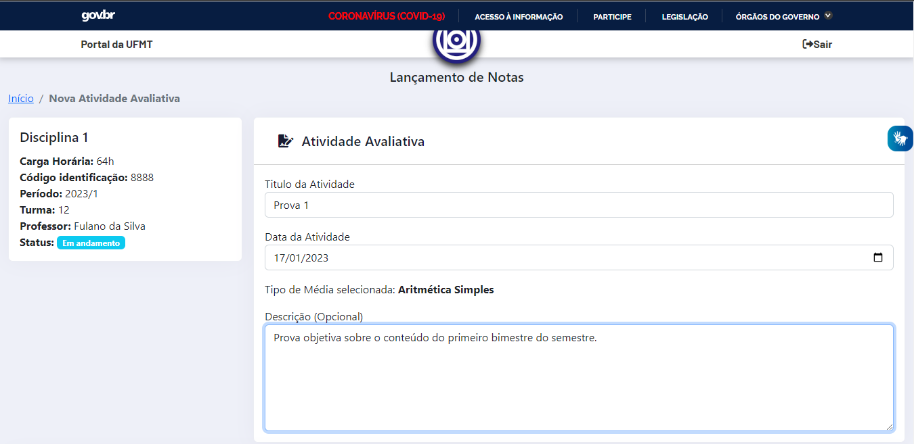
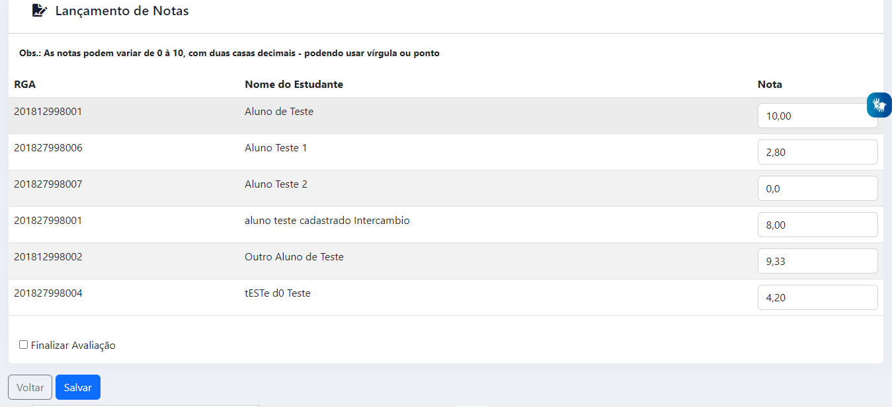
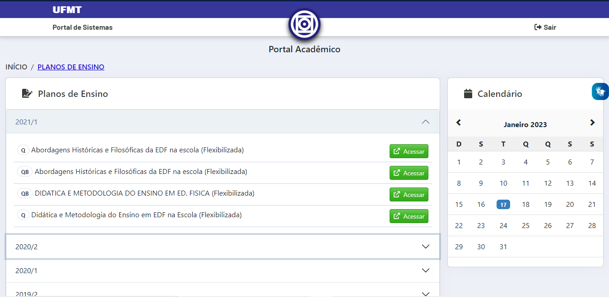
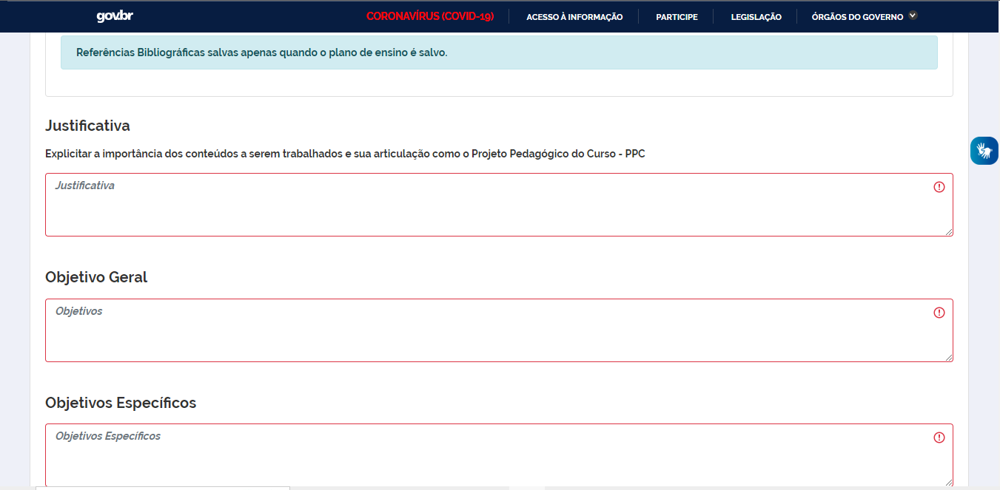

# Portal Acadêmico - Docente 

O Portal Acadêmico da UFMT é o resumo dos esforços da STI em melhorar os serviços disponibilizados à comunidade acadêmica. Essa ferramenta tem por objetivo substituir gradualmente o atual Sistema de Informações de Gestão Acadêmica (SIGA) e foi desenvolvida observando diversas críticas e opiniões. Visa também garantir uma maior acessibilidade às ferramentas desta instituição e compatibilidade com os navegadores de *internet* e aparelhos móveis.

Atualmente o Portal Acadêmico do Docente conta com as seguintes Ferramentas do Professor:

* Salas virtuais
* Lançamento de Frequência
* Lançamento de Notas
* Planos de Ensino
* Aulas de Campo

E com as seguintes consultas:

* Estudantes

## Acesso

Para acessar o Portal Acadêmico basta que o docente acesse o [Portal de Sistemas](https://sistemas.ufmt.br) Integrados e busque por 'portal' ou 'pa' e clique no resultado, 'PA - Portal Acadêmico'.

## Página inicial (Home)

Na página inicial do sistema, é possível visualizar algumas opções que são competência do professor realizá-las, como lançamento de frequências, lançamento de notas, o plano de ensino, entre outras...

## Salas Virtuals

Nesse local o docente tem acesso às disciplinas vinculadas à ele no Ambiente Virtual de Aprendizagem.

!!! warning "Atenção"
    A partir do semestre 2021/2 a UFMT passará a utilizar uma nova versão do ambiente de salas de aulas virtuais. Infelizmente a nova versão não é nativamente compatível com a atualmente utilizada, mas a versão atual ficará disponível para consultas e recuperação de backups, podendo estes backups serem restaurados pelos docentes para sua nova versão.

## Lançamento de Frequências

Nesta tela é possível selecionar a turma por interstício da disciplina ofertada pelo docente. Clicando em "Lançar Frequência" na disciplina que o professor quer adicionar o diário da disciplina, é possível registrar alguns dados.

> 
> Figura 1 - Tela completa do Lançamento de Frequências

Logo após, é possível visualizar os **detalhes da disciplina**, cadastrar as aulas ministradas, como também imprimir o diário em branco, o diário preenchido e importar a frequência via planilha eletrônica (no formato xls). Para ter mais detalhes de como realizar a importação via planilha eletrônica, basta clicar [aqui](notasexcel.md).

> 
> Figura 2 - Tela com todos os detalhes da disciplina

## Lançamento de aulas ministradas

Nesta tela o professor deve adicionar os dados relativo a aula ministrada. Os **dados obrigatórios** são: data, carga horária da aula, horário de início e o conteúdo programático ministrado; o docente pode também adicionar algumas informações, não sendo um campo obrigatório.

> 
> Figura 3 - Nova Frequência

Abaixo nesta tela, é possível visualizar a lista de alunos que estão matriculados na disciplina. Para informar a **ausência de um discente**, basta marcar a caixa de "Registrar Faltas", também é possível informar as "Horas de Atraso" e adicionar as seguintes **opções na presença do aluno**:

* Vincular: Aluno participa da listagem
* Desvincular: Aluno não participa dessa listagem
* Regime Domiciliar: Aluno afastado via processo

> 
> Figura 4 - Lista de alunos

Por fim, basta clicar no botão "Salvar", que a aula ministrada será adicionada na carga horária da disciplina.

## Lançamento de Notas

Nesta tela o sistema separa as disciplinas por semestre, basta clicar na seta da direita e as disciplinas lecionadas pelo docente no interstício serão exibidas.

> 
> Figura 5 - Disciplinas para o lançamento de notas

É possível alterar a forma de se calcular a média, podendo escolher a **média aritmética simples** ou a **média ponderada**. Ainda é possível importar uma **planilha eletrônica** com as notas e médias já calculadas.

> 
> Figura 6 - Lançamento de notas

Além disso, caso a disciplina tenha uma **média de corte para a Prova final** diferente da média padrão da UFMT, o docente pode alterar no campo mais abaixo da composição da média avaliativa.

**Lançando a avaliação**, deve-se adicionar o nome, data e uma descrição.

> 
> Figura 7 - Dados da avaliação

> 
> Figura 8 - Adicionando notas

Ademais, adiciona-se as notas da avaliação de cada estudante e clique em salvar. Lembre-se, o docente pode **finalizar** ou não a avaliação, sendo possível adicionar novas notas depois.

## Planos de Ensino

Semelhante as demais telas, ao clicar em **Plano de Ensino** ele será direcionado a tela abaixo, para selecionar qual semestre e disciplina que o solicitante deseja elaborar/editar o plano de ensino.

> 
> Figura 7 - Plano de ensino

Selecionando a disciplina, o sistema abre um **formulário** que deve ser preenchido com todos os dados necessário sobre o plano de ensino da referida disciplina.

> 
> Figura 8 - Formulário do plano de ensino

## Aulas de Campo

Na funcionalidade de **aulas de campo**, o docente deve preencher um formulário padrão sobre a aula ministrada no **ambiente externo** da universidade.

> 
> Figura 9 - Tela completa do Lançamento de Notas

## Críticas e Sugestões?

Encaminhe uma mensagem para <ces.sti@ufmt.br>

## Outros endereços úteis:

* [Manual para lançamento de notas via planilha eletrônica (Excel)](notasexcel.md)
* Manual do Novo AVA