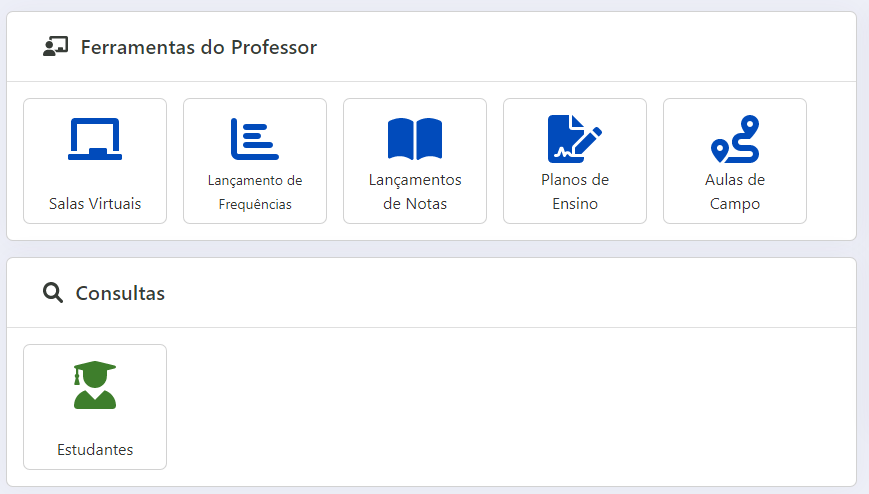

# Portal Acadêmico - Docente 

O Portal Acadêmico da UFMT é o resumo dos esforços da STI em melhorar os serviços disponibilizados à comunidade acadêmica.
Ele foi desenvolvido observando diversas críticas e opiniões da comunidade acadêmica, visa garantir uma maior acessibilidade às ferramentas desta instituição e melhor compatibilidade com os navegadores de *internet* e aparelhos móveis.

Atualmente o Portal Acadêmico do(a) Docente conta com as seguintes Ferramentas para o(a) Professor(a):

* Salas virtuais
* Lançamento de Frequência
* Lançamento de Notas
* Planos de Ensino
* Aulas de Campo

O(a) docente também tem à disposição uma **consulta** por disciplina ministrada, com a relação de todos(as) os(as) discentes registrados(as).
Essa consulta informa: o RGA, o nome completo, o e-mail institucional do(a) discente e se esse(a) discente é uma pessoa com deficiência.

## Acesso

Para acessar o Portal Acadêmico acesse o [Portal de Sistemas Integrados](https://sistemas.ufmt.br) e busque por 'portal' ou 'pa' e clique no resultado, 'PA - Portal Acadêmico'.

Logo na página inicial do sistema é possível visualizar as ferramentas disponíveis, como lançamento de frequências, lançamento de notas etc.

> 

> Figura 1 - Tela inicial do Portal Acadêmico do Docente

## Salas Virtuais

Nesse local o(a) docente tem acesso às disciplinas no Ambiente Virtual de Aprendizagem.
Um conjunto de manuais para o AVA pode ser obtido [aqui](http://sistemas.ufmt.br/arquivos/Manuais_AVA.zip).

## Lançamento de Frequências

Nessa tela as disciplinas ofertadas pelo curso e ministrada pelo(a) docente são agrupadas pelo período de oferta.
Clicando em "Lançar Frequência", é possível registrar alguns dados.

> 

> Figura 2 - Tela completa do Lançamento de Frequências

Logo após, é possível visualizar os **detalhes da disciplina**, cadastrar as aulas ministradas, como também imprimir o diário em branco, o diário preenchido e importar a frequência via planilha eletrônica (no formato xls).

> 

> Figura 3 - Tela com todos os detalhes da disciplina

Após clicar no botão "Adicionar" (apresentado na Figura 2) o(a) docente deve adicionar os dados relativo a aula ministrada.
Os **dados obrigatórios** são: a data da aula ministrada, a carga horária da aula, o horário de início e o conteúdo programático ministrado; o(a) docente pode também adicionar algumas informações adicionais, não sendo um campo obrigatório.

> 

> Figura 4 - Nova Frequência

Mais abaixo nessa mesma tela é possível visualizar a lista de discentes que estão matriculados na disciplina.

Para informar a **ausência de um discente**, basta marcar a caixa de "Registrar Faltas".
Se apenas esse campo for marcado a carga horária dessa frequência será descontada da carga horária total da disciplina.

Também é possível informar apenas um atraso parcial, preenchendo o campo "Horas de Atraso", sendo esse o valor descontado da carga horária total da disciplina.

Adicionalmente as **opções na presença do aluno** podem ser editadas:

* Vincular: Aluno participa da listagem
* Desvincular: Aluno não participa dessa listagem
* Regime Domiciliar: Aluno afastado via processo

>  discente")

> Figura 5 - Lista de discentes

Por fim, basta clicar no botão "Salvar", que a aula ministrada será adicionada na carga horária da disciplina.

## Lançamento de Notas

Nessa tela as disciplinas ofertadas pelo curso e ministrada pelo(a) docente são agrupadas pelo período de oferta.
Para desagrupar basta clicar na seta da direita.

> 

> Figura 6 - Disciplinas para o lançamento de notas

É possível alterar a forma de se calcular a média, podendo escolher a **média aritmética simples** ou a **média ponderada**.
Ainda é possível importar uma **planilha eletrônica** com as notas e médias já calculadas.
Para ter mais detalhes de como realizar a importação via planilha eletrônica, basta clicar [aqui](notasexcel.md).

> 

> Figura 7 - Lançamento de notas

Além disso, caso a disciplina tenha uma **média de corte para a Prova final** diferente da média padrão da UFMT, o(a) docente pode alterar no campo mais abaixo da composição da média avaliativa.

Para lançar uma avaliação clique no botão "Cadastrar Nova Avaliação".
Na tela que for exibida deve-se adicionar o titulo da atividade, a data e uma descrição.

> 

> Figura 8 - Dados da avaliação

Ademais, adicione as notas da avaliação de cada estudante e clique em "Salvar".

> 

> Figura 9 - Adicionando notas

O(a) docente pode marcar a opção **Finalizar Avaliação** ou não, caso deseje adicionar ou modificar as notas posteriormente.
Apenas as atividades que estiverem marcadas como finalizadas serão exibidas no Diário de Classe do(a) discente. 

Se ao menos uma atividade for registrada e marcada como finalizada será exibido o botão "Cadastrar Prova Final".
Ao clicar no botão "Cadastrar Prova Final" serão listados somente os discentes que não atingiram o filtro registrado na Figura 6.

Por fim, recomenda-se que somente após o registro de todas as atividades e da Prova Final que o(a) docente clique no botão "Homologar Notas".

## Planos de Ensino

Semelhante as demais telas, ao clicar em **Plano de Ensino** o(a) docente será direcionado a tela abaixo, para selecionar qual semestre e disciplina que o solicitante deseja elaborar/editar o plano de ensino.

>  docente quer criar/editar o plano")

> Figura 10 - Plano de ensino

select * from dbo.SigaControleTempoIntegralizacaoAlunos where RGAALUNO = 201412402011Selecionando a disciplina, o sistema abre um **formulário** que deve ser preenchido com todos os dados necessário sobre o plano de ensino da referida disciplina.

> 

> Figura 11 - Formulário do plano de ensino

## Aulas de Campo

Na funcionalidade de **aulas de campo**, o(a) docente deve preencher um formulário padrão sobre a aula ministrada no **ambiente externo** da universidade.

> 

> Figura 12 - Tela completa do Lançamento de Notas

## Críticas e Sugestões

- Abra um chamado na Central de Serviços: <https://suporte.ufmt.br>

## Outros endereços úteis

* [Manual para lançamento de notas via planilha eletrônica (Excel)](notasexcel.md)
* [Conjunto de manuais do Novo AVA](http://sistemas.ufmt.br/arquivos/Manuais_AVA.zip)