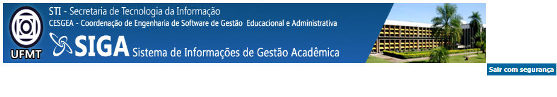
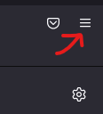
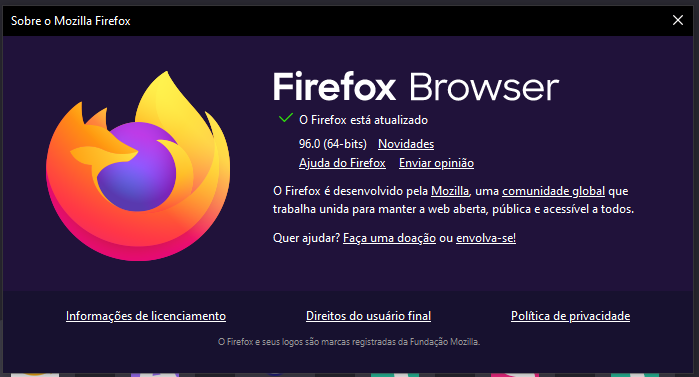
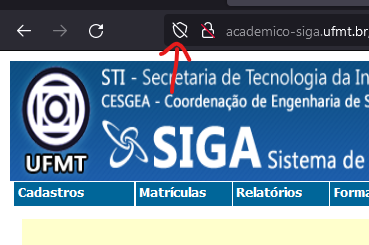
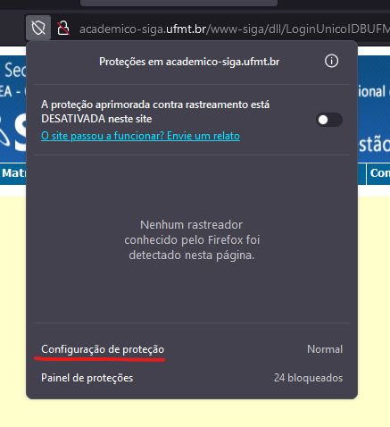
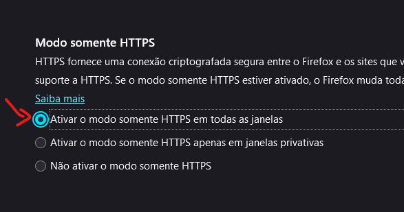

# Acesso aos Menus dos Sistemas Acadêmicos

Alguns navegadores podem apresentar problemas em exibir de forma satisfatória os sistemas acadêmicos de graduação e pós-graduação da UFMT,
respectivamente o **SIGA** e o **SIPG**.

A CSI, não medindo esforços em melhorar o ambiente digital da comunidade acadêmica, esta voltando seu corpo de trabalho no desenvolvimento
de uma nova versão do Portal Acadêmico, mais adequado com as novas tecnologias e menos suscetível à falhas de interface. Ele já está disponível para os **discentes e docentes** da UFMT. Basta acessar o Portal de Sistemas Integrados e depois buscar por 'portal acadêmico'.

Uma medida paliativa é a configuração do navegador para que este possa exibir corretamente o conteúdo desses sistemas acadêmicos.

O navegador recomendável atualmente (_em 13/01/2022_) é o [Firefox](https://www.mozilla.org/pt-BR/firefox/new/).

## Firefox

Os procedimentos abaixo foram indicados usando o SIGA mas são os mesmos para o SIPG. Basta realizar uma vez para ambos os sistemas ficarem acessíveis.

Verifique se o seu navegador está na última versão. A testada nesse procedimento foi a 96.0.

Para saber a versão, clique no ícone para abrir o menu do Firefox (são os 3 traços horizontais no canto superior do navegador), depois em **Ajuda** e por fim em **Sobre o Firefox**.

Para realizar a liberação do SIGA acesse o Portal de Sistemas Integrados e depois acesse o SIGA. Nessa página, clique no ícone de configuração com o formato de um escudo.

Na pequena janela que abrir, clique em 'Configuração de proteção'.

Desça até o fim da página que foi aberta. Na região 'Modo somente HTTPS' certifique-se de marcar a opção 'Ativar o modo somente HTTPS em todas as janelas'.

E é isso. Você pode fechar essa página e reabrir a página do SIGA.