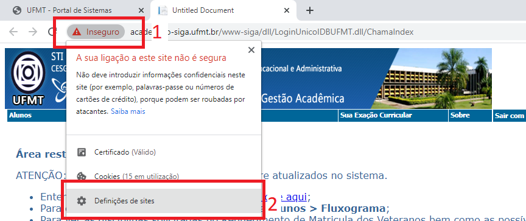
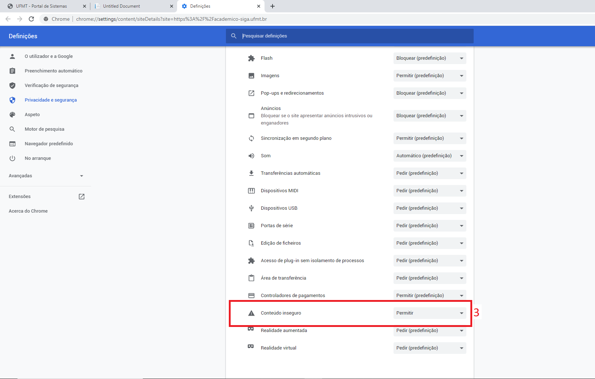

# Acesso aos Menus dos Sistemas Acadêmicos

Alguns navegadores podem apresentar problemas em exibir de forma satisfatória os sistemas acadêmicos de graduação e pós-graduação da UFMT,
respectivamente o **SIGA** e o **SIPG**.

A CES, não medindo esforços em melhorar o ambiente digital da comunidade acadêmica, esta voltando seu corpo de trabalho no desenvolvimento
de uma nova versão do Portal Acadêmico, mais adequado com as novas tecnologias e menos suscetível à falhas de interface.

Com isso, é recomendado uma medida paliativa, configurando-se o navegador para que este possa exibir corretamente o conteúdo dos sistemas acadêmicos atuais.

## Chrome

### Método 1

Na barra de endereço do navegador, localize e clique no texto 'inseguro' do lado esquerdo. No painel que se expandir, clique em 'Definições de sites'.

Na tela de configurações que for aberta, localize no final da página a opção 'Conteúdo inseguro' e escolha a opçaõ 'Permitir'.

### Método 2

