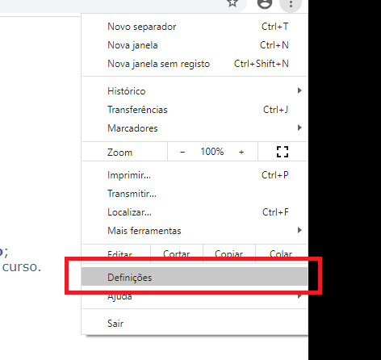
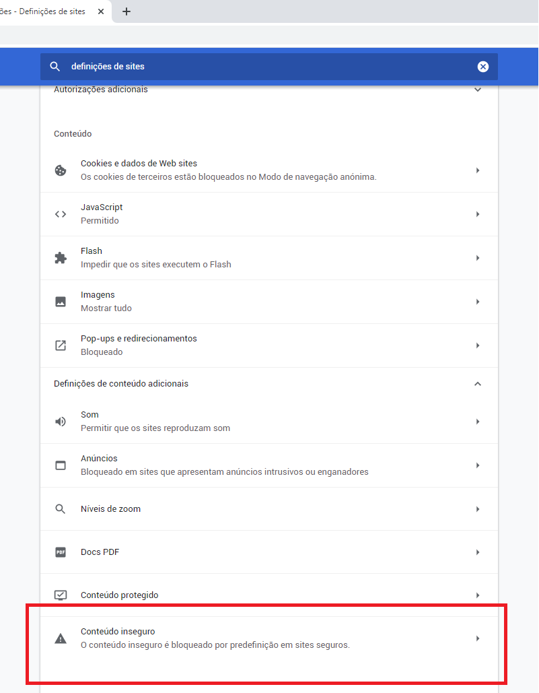

# Acesso aos Menus dos Sistemas Acadêmicos

Alguns navegadores podem apresentar problemas em exibir de forma satisfatória os sistemas acadêmicos de graduação e pós-graduação da UFMT,
respectivamente o **SIGA** e o **SIPG**.

A CES, não medindo esforços em melhorar o ambiente digital da comunidade acadêmica, esta voltando seu corpo de trabalho no desenvolvimento
de uma nova versão do Portal Acadêmico, mais adequado com as novas tecnologias e menos suscetível à falhas de interface.

Com isso, é recomendado uma medida paliativa, configurando-se o navegador para que este possa exibir corretamente o conteúdo dos sistemas acadêmicos atuais.

Aqui constam as instruções para o [Chrome](#chrome), [Firefox](#firefox) e [Opera](#opera)

## Chrome

### Método 1

Na barra de endereço do Chrome, localize e clique no texto 'inseguro' do lado esquerdo. No painel que se expandir, clique em 'Definições de sites'.

Na tela de configurações que for aberta, localize no final da página a opção 'Conteúdo inseguro' e escolha a opção 'Permitir'.

### Método 2

No menu do Chrome, expanda as opções (**⋮**) e clique em 'Definições'

Na tela apresentada, digite 'definições de sites' e clique na opção encontrada

No final da página encontre e clique na opção 'Conteúdo inseguro'

Nas opções expandidas, adicione os endereços `https://academico-siga.ufmt.br:443` e `https://academico-siga.ufmt.br:80`

## Firefox

### Método 1

Na barra de endereço do Firefox, localize e clique no icone do cadeado.
Depois clique no sinal **>** para expandir as opções

Na informação expandida clique em 'Desativar proteção por enquanto'

### Método 2

No campo de endereço, digite about:config

Clique no botão Serei cuidadoso, prometo

No campo de pesquisa, digite block_active

Defina o valor de security.mixed_content.block_active_content para falso

## Opera