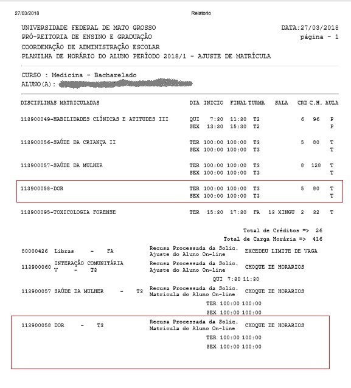

# Conferindo o resultado da matrícula

O requerimento de matrícula ou o ajuste do aluno passam por um processamento.
A matrícula realizada é um pedido de matrícula em disciplina, que vai ser processado conforme:

* o regime do curso (crédito ou seriado)
* a oferta de horários das disciplinas no período
* a estrutura do curso
* e o histórico do aluno

Para curso ofertado em regime seriado a **Resolução CONSEPE nº 14/99** estabelece as diretrizes e para curso ofertado em regime de créditos as *Resoluções CONSEPE nº 52/94 e 32/99* contém as regulamentações.

Conhecer a estrutura e o regime do curso é essencial para o entendimento da matrícula. Nos cursos seriados a matrícula segue conforme as séries, sequencialmente e sucessivamente, e reprovações retêm ou deixam o aluno em dependência na série. Os cursos créditos seguem as regras de pré-requisito, co-requisito, carga horária mínima, etc.

Resumidamente, o **regime seriado** consiste na organização das disciplinas em séries de tal forma que as disciplinas de uma série sejam 'preparatórias' para as das séries subsequentes. Só ascenderão à série seguinte os alunos que tenham sido reprovados em no máximo duas disciplinas. Aqueles que não atenderem essa condição permanecerão retidos na série.

No **regime de crédito** os alunos matriculam-se em disciplinas de diferentes semestres desde que sejam observados os pré-requisitos, co-requisitos, carga horária mínima necessária, etc conforme apresentado na estrutura curricular do curso. Para sanar as dúvidas sobre o regime e estrutura do curso, favor procure a sua coordenação.

O restante das informações necessárias estão disponíveis no SIGA (sistema acadêmico), acessado através do Portal de Sistemas Integrados no site da UFMT e no aplicativo.

## SIGA

### Estrutura do curso

O sistema SIGA apresenta as informações necessárias pro aluno conhecer sua situação acadêmica.
Em **Cursos > Estrutura Geral** é possível conhecer o regime e a estrutura do curso:

### Fluxograma

Outro recurso importante para o entendimento da situação acadêmica é o **fluxograma**. O fluxograma do aluno demonstra com uma representação gráfica detalhes sobre sua vida acadêmica. Através do caminho **Alunos > Fluxograma** é possível obter informações sobre a série e as disciplinas retidas para os cursos seriados ou  a situação dos pré-requisitos para os cursos créditos:

### Histórico Escolar e Planilha de Horário

Outros recursos importantes para os alunos são o Histórico Escolar e a Planilha de Horários. No histórico escolar constam as informações sobre as reprovações, aprovações, aproveitamento de estudos, as disciplinas cursadas como atividade complementar, total de carga horária cursada, coeficiente de rendimento, etc. O histórico encontra-se em **Documentos > Histórico Escolar** e também no **aplicativo**. No menu **Documentos** encontram-se também as planilhas de horário. A planilha de horário com recusas (**Documentos > Planilha de Horário c/ Recusas**) informa o resultado da matrícula (com o motivo da recusa do pedido de matrícula) além dos horários das disciplinas matriculadas no período:

### Oferta de disciplinas

Após o conhecimento da sua situação acadêmica, o aluno deve conferir a oferta de horários do período. As disciplinas são ofertadas pela coordenação do curso e influenciam diretamente o resultado da matrícula. Para conferir as disciplinas ofertadas pela coordenação no período, basta acessar  os links presentes nos sistemas de matrícula ou no SIGA em **Horários > Oferta/Disciplinas e Horários por Curso**:

Caso a disciplina desejada não tenha sido ofertada ou esgotou o número de vagas procure a coordenação do seu curso.